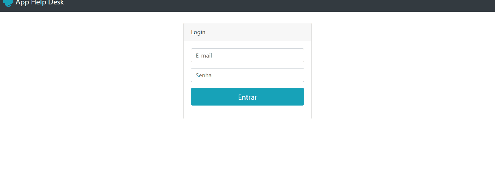

# App Help Desk
## Link: https://app-help-desk.epizy.com 

### Obs: Eu utilizei uma plataforma de hospedagem gratuita https://www.infinityfree.net/ , então não sei o porque, mas o google está entendendo como não seguro o meu site, porém tenham em mente que eu criei com o único fim de estudos, então fiquem tranquilos.

 Criei esse projeto para exercitar minhas habilidades em php, é um sistema de cadastro de chamados no qual terão 2 tipos de usuários:
o administrativo e o comum, vou deixar os usuários com as senhas cadastradas para que vocês possam testar a aplicação. Neste projeto ainda não implementei o banco de dados,
então os usuários forão predefenidos de um array e as informções estão sendo gravadas num arquivo de texto, para assim serem recuperadas e mostradas, em consultar chamados.

## Usuários:

adm@teste.com.br (Administrativo pode consultar todos os chamados)

user@teste.com.br (Administrativo pode consultar todos os chamados)

jose@teste.com.br (Comum pode consultar apenas os seus chamados)

maria@teste.com.br (Comum pode consultar apenas os seus chamados)

## Senha para todos:

1234

